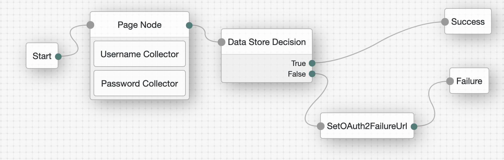

# Set OAuth2 Failure URL

## Introduction

This JS Scripted decision node can be used to set the failure URL in case of a failed authentication attempt. By default, there is no gotoOnFail set, so the End-User remains on the Failed Login page. With this scripted node, an appropriate Failure URL is set so a redirect to the Client application can take place with an appropriate error message, as per the OAuth2 specification: https://datatracker.ietf.org/doc/html/rfc6749#section-4.1.2.1 


## Contents

Example AM tree



The attached scripted decision node will be used after an unsuccessful authentication and prior to the Failure node. The script will fetch the OAuth2 redirect_uri and state parameters via the 'Referer' request header and then build the failure URL accordingly.

## Configuration

Create an AM scripted decision node using the node in the [src](src) directory

- set-oauth2-failure-url.js


## Testing 

Test OAuth2 Authorization Code flow. The logging when the End-User authentication fails and the scripted node sets the failure URL:
```
DEBUG: ******TasosDebug:SetFailureURL node executing
ERROR: ******TasosDebug:SetFailureURL Referer is OAuth2 authorization endpoint
ERROR: ******TasosDebug:SetFailureURL Referer:http://anastasios-kampas-am-hfwnjhz.test:8080/openam/XUI/?realm=/&goto=http://anastasios-kampas-am-hfwnjhz.test:8080/openam/oauth2/authorize?response_type%3Dcode%26client_id%3DmyClientID%26realm%3D/%26scope%3Dopenid%2520profile%26redirect_uri%3Dhttp://anastasios-kampas-am-hfwnjhz.test:8080/openid/cb-basic.html%26state%3Daf0ifjsldkj
ERROR: ******TasosDebug:SetFailureURL Checking referer [http://anastasios-kampas-am-hfwnjhz.test:8080/openam/XUI/?realm=/&goto=http://anastasios-kampas-am-hfwnjhz.test:8080/openam/oauth2/authorize?response_type] against name [redirect_uri] and [state]
ERROR: ******TasosDebug:SetFailureURL Checking referer [client_id] against name [redirect_uri] and [state]
ERROR: ******TasosDebug:SetFailureURL Checking referer [realm] against name [redirect_uri] and [state]
ERROR: ******TasosDebug:SetFailureURL Checking referer [scope] against name [redirect_uri] and [state]
ERROR: ******TasosDebug:SetFailureURL Checking referer [redirect_uri] against name [redirect_uri] and [state]
ERROR: ******TasosDebug:SetFailureURL Found redirect_uri: http://anastasios-kampas-am-hfwnjhz.test:8080/openid/cb-basic.html
ERROR: ******TasosDebug:SetFailureURL Checking referer [state] against name [redirect_uri] and [state]
ERROR: ******TasosDebug:SetFailureURL Found state: af0ifjsldkj
ERROR: ******TasosDebug:SetFailureURL TasosDebug:SetFailureUrl: http://anastasios-kampas-am-hfwnjhz.test:8080/openid/cb-basic.html#error=access_denied&state=af0ifjsldkj
```

The response from the /authenticate API after the end of the tree with 401 response code:
```
{
    "code": 401,
    "reason": "Unauthorized",
    "message": "Login failure",
    "detail": {
        "failureUrl": "http://anastasios-kampas-am-hfwnjhz.test:8080/openid/cb-basic.html#error=access_denied&state=af0ifjsldkj"
    }
}
```